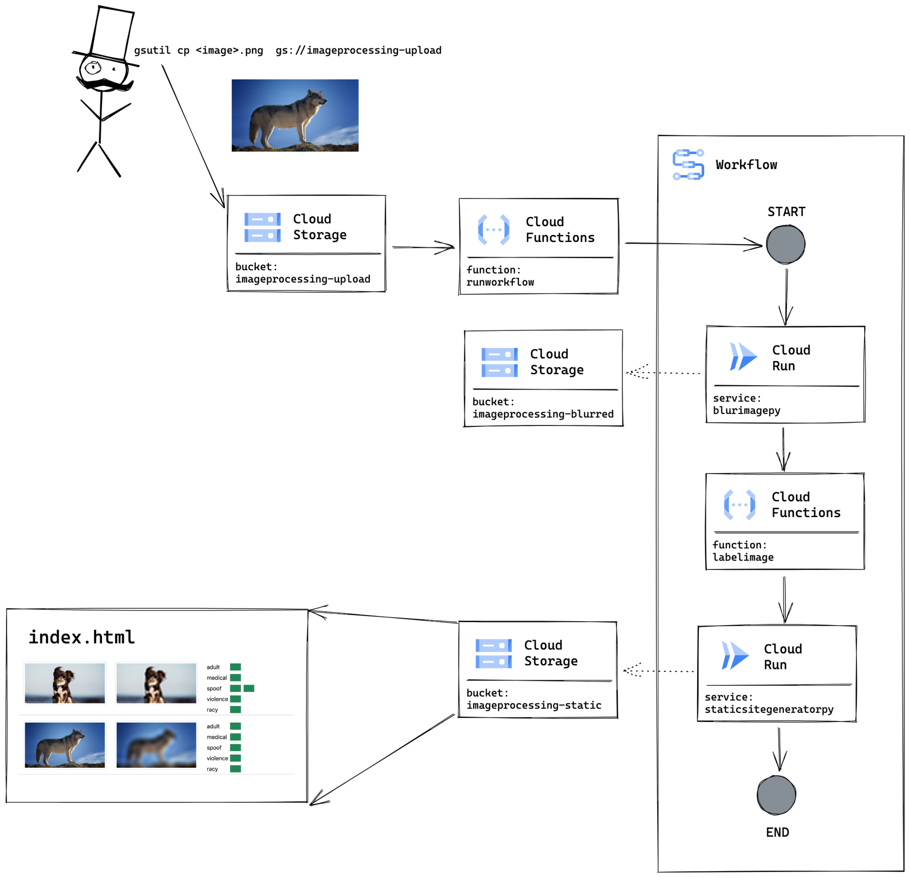

# Python on GCP 🎄
Small project to learn about running Python services on Google Cloud Platform.

Scenario
1. User uploads image to `imageprocessing-upload`
2. Cloud function `runworkflow` creates an exection of workflow
3. Workflow
   * Cloud run `blurimagepy` creates a blurred version of the uploaded image
   * Cloud function `labelimage` analyzes the likelyhood of the image portraing violence, nudity, etc, and stores as a metadata field on the original image  
3. Output is stored in `imageprocessing-static/index.html`

## Lessons learnt & thoughts

* Google Cloud [Workflows](https://cloud.google.com/workflows) 
    * A pretty solid way of grouping multiple functions together. 
    * I didn't find a way of running things in parallel.
    * Introducing a [human in the loop](https://cloud.google.com/workflows/docs/tutorial-callbacks-firestore?hl=en-GB), using callback looks pretty awesome. 
* Cloud storage 
   * Has built in caching, which really messes with the idea of automatic reload of `index.html`. I tried setting `Cache Control: no-cache, max-age=1`, but it doesn't seem to solve the problem. I probably spent 25% of the project time on this "issue".
   * Storing information a metadata field on a file seems to work well! Might be better alternatives, such as Firestore.
* Cloud functions
    * First time (almost) working with `Cloud functions` over `Cloud run`. Works great!
* Python
    * The documentation for the Cloud Storage Python client (and Python packages in general), is a lot slower to consume, than I am used to from Go. Strongly typed languages are awesome when exploring an API 🥰. 

